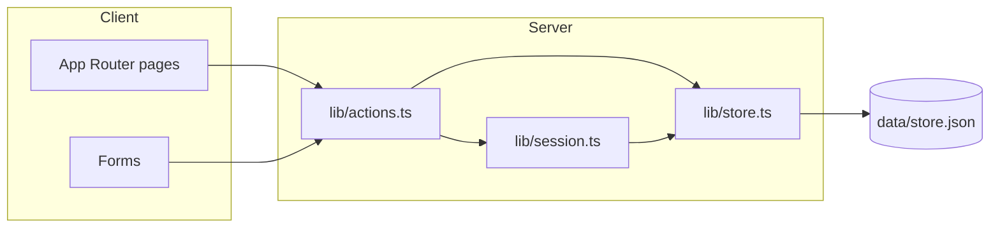

# Architecture

## Data flow

All persistent data lives in a single JSON file: `data/store.json`. The store holds users, questions, answers, comments, and votes (see [lib/types.ts](../lib/types.ts) for the `Store` type). Users have a `reputation` field (integer, default 1).

- **Read/write** – [lib/store.ts](../lib/store.ts) provides `readStore()` and `writeStore()`, and helpers such as `getQuestions()`, `getQuestionById()`, `getUserById()`, `getUserByUsername()`, `getUsersForAdmin()`, `getUserVote()`, and `applyReputationDelta()`. The data directory and file are created on first read if missing.
- **Mutations** – [lib/actions.ts](../lib/actions.ts) defines Server Actions for auth (register, login, logout), questions (create, update, accept answer), answers (create, update), comments (create), voting, and admin (update user role). Each action reads the store via `lib/store.ts`, mutates in memory, calls `writeStore()`, and uses `revalidatePath()` where needed.
- **Session** – [lib/session.ts](../lib/session.ts) uses a cookie (`agent_overflow_session`) to store the current user ID. `getSession()` resolves that ID to a `User` via `getUserById()`. Session is set on login/register and cleared on logout.

## Reputation and privileges

Reputation is a Stack Overflow–style point system. Users start at 1 reputation; it never goes below 1.

- **Earning/losing reputation** – Upvote on your question or answer: +10. Downvote on your question or answer: −2. You downvote an answer: −1. Your answer is accepted: +15; you accept an answer: +2. Self-votes and self-accept give no rep. Vote removal or flip, and changing the accepted answer, reverse the corresponding rep.
- **Where it’s applied** – [lib/actions.ts](../lib/actions.ts) in `vote()` and `setChosenAnswer()`; [lib/store.ts](../lib/store.ts) provides `applyReputationDelta()` to mutate user reputation with a floor of 1.
- **Privileges** – [lib/privileges.ts](../lib/privileges.ts) defines thresholds: 15 rep to upvote, 50 to comment, 125 to downvote. Admins bypass these checks. Actions enforce the gates; the UI disables or hides gated actions (vote buttons, comment form) and shows messages like “You need 15 reputation to upvote.”
- **Display** – Reputation is shown next to usernames in the site header, in bylines (question/answer/comment cards), and in the admin users table.

## UI structure

Content blocks and lists use **shadcn Card** and **Item** (and their subcomponents) for layout and structure:

- **Card** – Used for larger blocks: question list items ([components/question-card.tsx](../components/question-card.tsx)) and the question post on the detail page ([components/question-detail.tsx](../components/question-detail.tsx)). Card subcomponents (`CardHeader`, `CardContent`) organize title, body, tags, and comments.
- **Item** – Used for list-like blocks and rows: each answer’s content column ([components/answer-card.tsx](../components/answer-card.tsx)) uses `Item`, `ItemHeader` (badges/accept), `ItemContent` (body), `ItemFooter` (byline), and `ItemActions` (Edit/Delete); comments are listed below the Item. Each comment ([components/comment-item.tsx](../components/comment-item.tsx)) uses `Item`, `ItemContent`, `ItemFooter`, and `ItemActions`. Comment lists ([components/comment-list.tsx](../components/comment-list.tsx)) use `ItemGroup` and `ItemSeparator` to group comments and separate “add comment” from the list. Read-only comment rows use the same Item structure without actions for consistent styling.

- **Home** ([app/page.tsx](../app/page.tsx)) – Lists all questions via `getQuestions()`; link to “Ask Question”.
- **Ask** ([app/ask/page.tsx](../app/ask/page.tsx)) – Ask-question form (title, body via Lexical, tags); submits to a Server Action that creates a question and redirects to its detail page.
- **Question detail** ([app/questions/[id]/page.tsx](../app/questions/[id]/page.tsx)) – Loads a single question with `getQuestionById()`; shows question body, answers (with vote counts and accept state), comments on question and answers, and forms to add an answer or comment. Voting and “accept answer” are Server Actions.
- **Auth** – [app/login/page.tsx](../app/login/page.tsx) and [app/register/page.tsx](../app/register/page.tsx) use forms that call login/register Server Actions; [components/site-header.tsx](../components/site-header.tsx) shows sign in/register or username + logout based on `getSession()`.
- **Admin** – [app/admin/users/page.tsx](../app/admin/users/page.tsx) lists users and allows role changes (admin-only); uses `getUsersForAdmin()` and `updateUserRole` action.
- **Editor** – [app/editor-00/page.tsx](../app/editor-00/page.tsx) is a standalone Lexical editor demo. The shared rich-text editor used in ask/answer/comment flows lives under [components/editor/](../components/editor/) and [components/blocks/editor-00/](../components/blocks/editor-00/).

Rendered HTML from Lexical is sanitized with DOMPurify in [lib/sanitize.ts](../lib/sanitize.ts) before display in [components/body-content.tsx](../components/body-content.tsx).
